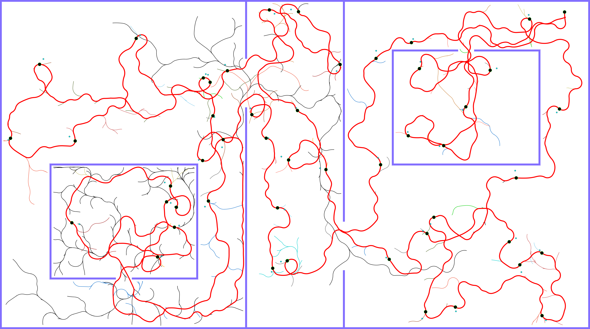

# KRRF algorithm

Final route for 50 cities with expanded trees


# Dependencies
Install SDL and gsl libraries:
```
sudo apt-get install libsdl1.2-dev libsdl-gfx1.2-dev libsdl-image1.2-dev  libgsl-dev
```

# How to compile

Go to src:

```
cd src
```


Run

```
make
```

to create planner binary. Result of the make process should be two binaries in the root:
1. ./LKH (TSP solver, which is compiled in ./libs/LKH/LKH-2.0.10/)
2. ./test_krrf which is our KRRF planner


# How to run KRRF. 

They are two options, either type:

```
./test_krrf 1
```

which will give you a list of command line options.

Or, you can run a prepared script:

```
./run_krrf.sh NMCP Q DHR MXTIME ITERS DTG MAP TARGET OUTPUT DRAW
```

where
NMCP - number of simulations from one node in KRRF
Q - parameter for balancing exploration and exploitation in KRRF (recommended to be $ \geq 0.5$)
DHR - heuristic radius for KRRF
MXTIME - maximal time of simulation of one node in KRRF
ITERS - number of iterations of whole Multi-goal KRRF algorithm
DTG - distance to goal, where the goal is recognised as passed through
MAP - path to the map file
TARGET - map corresponding file of all goals
OUTPUT - prefix for all output files
DRAW - whether to draw the output or not

For example, you can run the script like this:

```
./run_krrf.sh 10 0.7 100 1.5 1 50 ./maps/potholes.fig.tri ./targets/potholes.fig_5.txt out_krrf 1
```

To change the model of the robot, go to test_krrf.cc and uncomment which of the models will be used.

The statistic data are saved to OUTPUT.stat file, which is deleted automatically after each run of the script. The log file contains all stdout data, which were generated.


With this script, all output files will have the prefix 'out_krrf'. The resulting trajectory will be in .nodes wile (i.e., out_krrf.nodes), and visualization
will be in pdf files (prefix.*.pdf).


